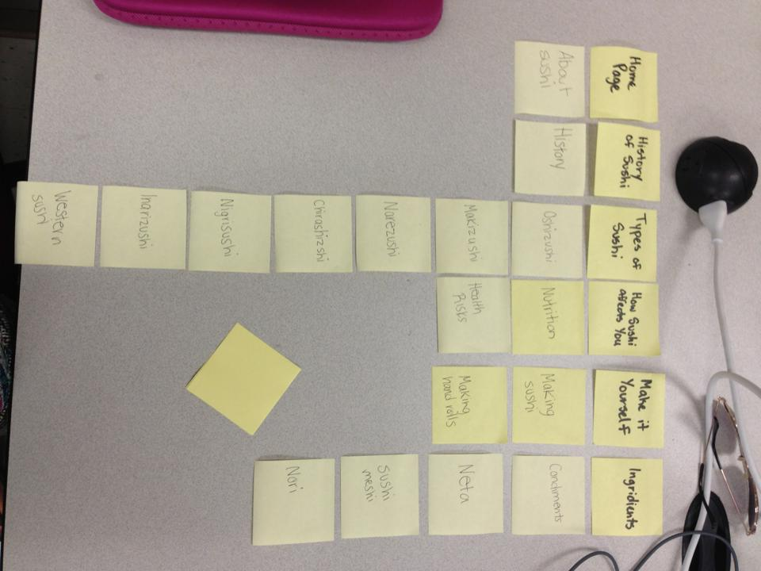
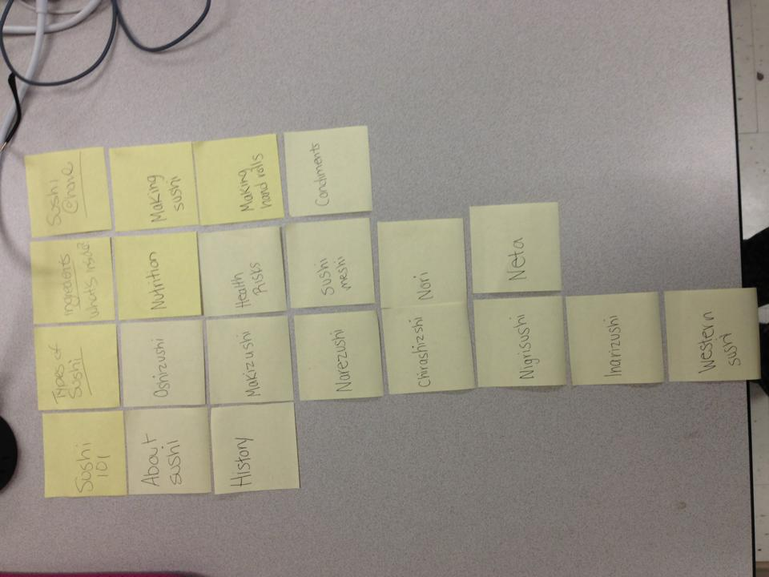

# Card sort report

The purpose of this card sort was to determine common navigation patterns and categories from the content of the Sushi website.

## Specifics

The card sort was conducted by Sarah on September 12, 2013 between the times of 3:00pm and 6:00pm with the following participants:

- Kelsey MacMillan
- Michelle Lauer

### Cards

17 cards were used covering a broad range of applicable content for the website. The following topics were used as cards:

1. Sushi Info
2. History
3. Chirashizushi
4. Inarizushi
5. Makizushi
6. Narezushi
7. Nigrizushi
8. Oshizushi
9. Western Style Sushi
10. Sushi-meshi
11. Nori
12. Neta
13. Condiments
14. Health Risks
15. Nutrition
16. Making Sushi
17. Making Hand Rolls

## Card sort results

*Card sort 1 by Kelsey MacMillan*

*Card sort 2 by Michelle Lauer*

## Observations

- Did the participants have any common comments?
	- They both commented that they like sushi.
	
- Did they have questions that stood out?
	- They both asked me what the ingredient cards meant (ex. Chirashizu, Inarizushi)
	
- Did they struggle with certain articles or topics?
	- They struggled with knowing what the ingredients were since they are not in english.
	
- Did they find common groupings? Or were the groupings completely different?
	- Yes. They both included the groups, Types of Sushi, Ingredients, and a make it yourself/at home group.
	
- Were some of the groupings completely unexpected?
	- No. The groupings were mostly expected. 
	
- Were the results similar to your expectations?
	- Yes. The results were similar to my expectations.
	
- How did you feel while watching them perform the task?
	- A little nervous to see if they would understand the words on the papers, but also excited to see what their groupings would be like. 